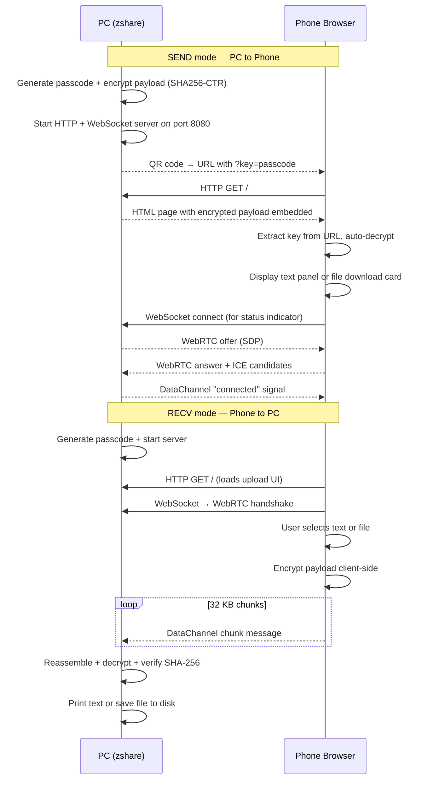

# ⚡ zshare

<div align="center">

<svg width="120" height="120" viewBox="0 0 24 24" fill="none" xmlns="http://www.w3.org/2000/svg">
  <path d="M5 4H19L11 12H16L8 20H22" 
        stroke="#00ffcc" 
        stroke-width="2" 
        stroke-linecap="round" 
        stroke-linejoin="miter" />
</svg>

**Zero-Config · End-to-End Encrypted · Local P2P Transfer**

[](https://nodejs.org)
[](LICENSE)
[](https://en.wikipedia.org/wiki/Block_cipher_mode_of_operation#CTR)
[](package.json)

*No cloud. No accounts. No setup on the receiving device. Just scan a QR.*

</div>

---

## ✨ What is zshare?

**zshare** is a CLI tool that creates an **instant, encrypted peer-to-peer transfer channel** between your PC and any other device on the same Wi-Fi network.

You run a single command. A QR code appears in your terminal. Someone scans it. Data flows — **encrypted, direct, zero-server**.

It works entirely over your **local network**: no data ever leaves your router, no third-party sees your files, and the receiving device needs nothing installed — just a browser.

---

## 🚀 Features

| Feature | Details |
|---|---|
| 📡 **Zero-setup receiver** | Just a QR scan — works in any modern mobile browser |
| 🔐 **End-to-end encryption** | SHA256-CTR stream cipher, 100% pure JS — no `crypto.subtle` dependency |
| ✅ **Integrity verification** | SHA-256 hash of plaintext/file bytes verified after every decryption |
| 📁 **File transfer** | Send any file up to 20 MB — PDF, image, zip, video, code, anything |
| 💬 **Text transfer** | Share passwords, links, snippets instantly |
| ↕️ **Bidirectional** | PC → Phone (`send`) and Phone → PC (`recv`) |
| 📦 **Chunked DataChannel** | 32 KB chunks with back-pressure control for reliable large transfers |
| 🎨 **Premium mobile UI** | Neon Cyber / Biopunk glassmorphic design with animations |
| 🔒 **Local network only** | Zero cloud dependency — your data stays on your router |

---

## 📦 Installation & Global Command Setup

To make the `zshare` command available globally in your system:

```bash
# 1. Clone the repository
git clone https://github.com/yourname/zshare.git
cd zshare-project

# 2. Install dependencies
npm install

# 3. Register the command globally
npm link
# or: npm install -g .
```

After doing this, you can run `zshare` directly from **any directory** in your terminal!

**Dependencies:** [`ws`](https://github.com/websockets/ws) · [`werift`](https://github.com/shinyoshiaki/werift-webrtc) · [`qrcode-terminal`](https://github.com/gtanner/qrcode-terminal)

---

## 🛠️ Usage

### Share Text — PC → Phone

```bash
node index.js send "Your secret message here"
# or
zshare send "Your secret message here"
```

```
╔══════════════════════════════════════════╗
║          zshare — SEND MODE              ║
╠══════════════════════════════════════════╣
║  🔑  Key:  zsh-k8f2n1                   ║
║  🔗  URL:  http://192.168.1.42:8080?key=…║
╚══════════════════════════════════════════╝

▄▄▄▄▄▄▄▄▄▄▄▄▄▄▄▄▄
█ ▄▄▄▄▄ █▀▄ █ ▀█▀█
█ █   █ █▀▀▀▄▄██▄█
█ █▄▄▄█ █▀ ▄▄▀▀ ██
█▄▄▄▄▄▄▄█▄▄▄▄▄▄▄██

🌐  Full URL: http://192.168.1.42:8080?key=zsh-k8f2n1
⏳  Waiting for receiver… (Ctrl+C to stop)
```

**→ Phone scans QR → browser opens → text is auto-decrypted → Copy button appears.**

---

### Share a File — PC → Phone

```bash
node index.js send ./report.pdf
node index.js send ./photo.jpg
node index.js send ./archive.zip
```

The receiver page automatically detects the file type and shows a **Save File** button with the original filename.

---

### Receive from Phone — Phone → PC

```bash
# Receive files and save to the current folder
zshare recv

# Receive files and save to a custom absolute/relative directory
zshare recv --dir /path/to/downloads
# or
zshare recv -d ./my-files
```

The phone browser shows a dual-mode upload interface:
- **Text tab** — textarea with a "Beam Text to PC" button
- **File tab** — drag-and-drop / tap-to-browse file picker

When the PC receives a file, it is automatically decrypted, verified, and saved to the target directory (which will be created recursively if it doesn't already exist):

```
╔══════════════════════════════════════════╗
║          FILE RECEIVED                   ║
╠══════════════════════════════════════════╣
║  📁  Name:  photo.jpg                   ║
║  📦  Size:  4.2 MB                      ║
║  💾  Saved: /Users/you/downloads/photo.jpg ║
╠══════════════════════════════════════════╣
║  ✅  SHA-256 integrity: VERIFIED        ║
╚══════════════════════════════════════════╝
```

---

## 🏗️ Architecture



---

## 🔐 Security Model

### Cipher: SHA256-CTR Stream Cipher

```
Key derivation:  K  = SHA-256(passcode)           [32 bytes]
Keystream block: B_i = SHA-256(K ‖ IV ‖ counter_i) [32 bytes per block]
Encryption:      C_i = P_i XOR B_i                [symmetric stream cipher]
```

### Integrity: SHA-256 Hash Verification

Every transfer includes a **SHA-256 hash of the original plaintext or raw file bytes**, computed *before* encryption and stored in the encrypted envelope. After decryption, the hash is recomputed and compared. Any mismatch (wrong passcode, corrupted data, tampered payload) causes an immediate error.

### Why Pure JS and Not `crypto.subtle`?

Modern browsers block `window.crypto.subtle` in [**insecure contexts**](https://developer.mozilla.org/en-US/docs/Web/Security/Secure_Contexts) — which includes all plain HTTP connections. Since zshare serves over HTTP on your local network (no TLS), using `crypto.subtle` would silently fail on the receiver's phone.

Instead, zshare ships an **identical cryptographic engine** in both the Node.js server and the browser `<script>` tag — pure JavaScript, zero dependencies, same behaviour everywhere.

### Passcode Format

```
zsh-xxxxxx  (e.g. zsh-k8f2n1)
```

- Embedded in the QR URL as a `?key=` parameter → **auto-decryption on scan**
- Also printed in the terminal → **manual entry option** on the lock screen
- The passcode is the only shared secret. Keep it off public channels.

### Limitations

| Risk | Mitigation |
|---|---|
| Anyone on the same Wi-Fi can scan the QR | Transfer completes in seconds; server can be stopped immediately |
| PRNG-based IV (`Math.random`) | IV is only used for a single session; collision probability is negligible |
| No forward secrecy | Each session uses a fresh random passcode |
| File size limit (20 MB) | Prevents excessively large HTML responses in the browser |

---

## 📁 Project Structure

```
zshare-project/
├── index.js        Main entry point (server + crypto + HTML templates)
├── package.json    Package manifest (type: "module", dependencies)
└── README.md       This file
```

### `index.js` Sections

| Section | Lines | Description |
|---|---|---|
| 1 · Crypto Engine | ~150 | Pure-JS SHA-256 + encoding helpers |
| 2 · SHA256-CTR Cipher | ~50  | Stream cipher (encrypt = decrypt) |
| 3 · High-Level API | ~80  | `encryptText`, `encryptFile`, `decryptText`, `decryptFile` |
| 4 · Utilities | ~100 | Passcode gen, file detection, MIME types, formatting |
| 5 · Browser Bundle | ~80  | Same crypto in ES5 string (injected into HTML) |
| 6 · HTML Builders | ~450 | `buildReceiverPage` + `buildTransmitterPage` |
| 7 · CLI Routing | ~20  | Argument parsing → mode selection |
| 8 · Sender Mode | ~70  | HTTP + WS server for PC→Phone transfers |
| 9 · Receiver Mode | ~90  | HTTP + WS server for Phone→PC transfers |

---

## 🤝 Requirements

- **Node.js 18+** (for ES module support: `import`/`export`)
- Both devices on the **same local network** (Wi-Fi or LAN)
- A modern browser on the receiving device (Chrome 80+, Safari 14+, Firefox 75+)

---

## 📝 License

MIT © 2024 — Do whatever you want, just don't be evil.

---

<div align="center">

Made with ⚡ and excessive amounts of SHA-256

</div>
